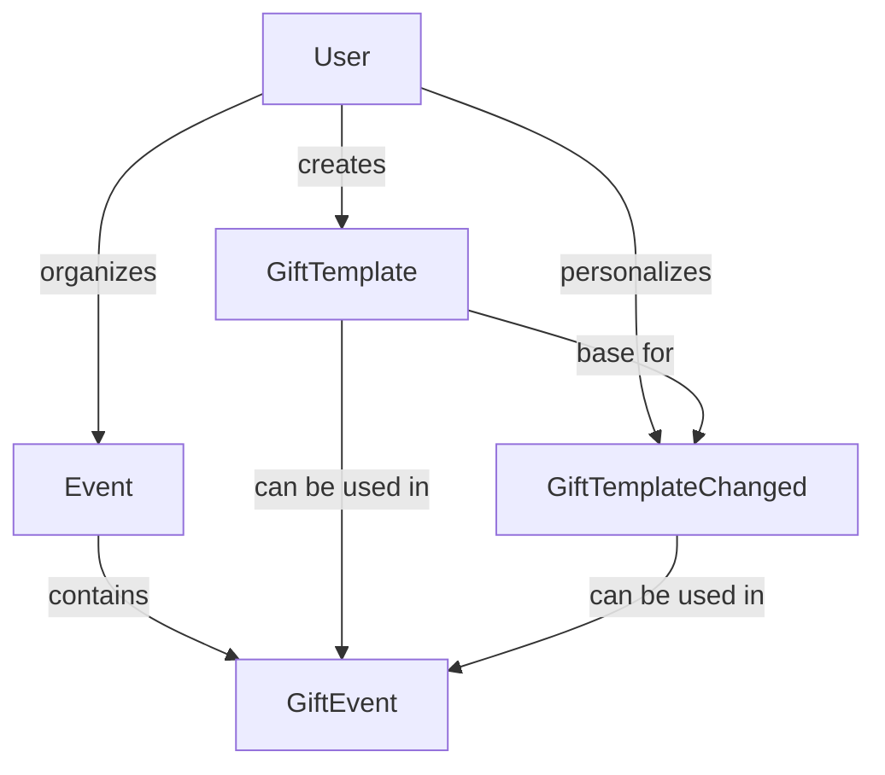

# Sistema de Presentes (Gifts) - Documentação Completa

## 📋 Visão Geral

O sistema de presentes implementa uma arquitetura hierárquica em três camadas para máxima flexibilidade e reutilização:

```
gift_template (catálogo base)
      ↓ (personalização)
gift_template_changed (variação customizada)
      ↓ (vinculação ao evento)
gift_event (instância no evento)
```

## 🏗️ Arquitetura

### 1. **GiftTemplate** - Catálogo Base Global
- **Propósito**: Templates reaproveitáveis de presentes
- **Criação**: Qualquer usuário pode criar
- **Visibilidade**: Pode ser público (reutilizável) ou privado
- **Casos de Uso**:
  - Catálogo pré-definido de presentes populares
  - Templates criados por usuários e compartilhados
  - Base para personalização

### 2. **GiftTemplateChanged** - Variações Personalizadas
- **Propósito**: Versões customizadas de um template base
- **Relação**: Sempre vinculado a um `GiftTemplate`
- **Personalização**: Título, descrição, imagem, valor, categoria
- **Casos de Uso**:
  - Usuário quer mudar o valor sugerido
  - Personalizar descrição ou imagem
  - Criar variação antes de adicionar ao evento

### 3. **GiftEvent** - Instância no Evento
- **Propósito**: Presente específico dentro de um evento
- **Flexibilidade**: Pode referenciar template base OU personalizado
- **Funcionalidades**: Controle de arrecadação, status, valor final
- **Casos de Uso**:
  - Lista de presentes do casamento
  - Controle de arrecadação
  - Status do presente (aberto/completo)

## 🛠️ Estrutura Técnica

### Entidades

#### GiftTemplate
```typescript
{
  id: number (PK)
  title: string (3-255 chars)
  description?: string (max 1000 chars)
  imageUrl?: string (max 500 chars)
  category?: string (max 100 chars)
  defaultValue?: number (decimal 10,2)
  eventType?: EventType (enum)
  isPublic: boolean (default: true)
  createdByUserId: number (FK)
  createdAt: Date
  updatedAt: Date
}
```

#### GiftTemplateChanged
```typescript
{
  id: number (PK)
  giftTemplateId: number (FK → GiftTemplate)
  title?: string (personalizado)
  description?: string (personalizado)
  imageUrl?: string (personalizado)
  value?: number (valor ajustado)
  category?: string (categoria personalizada)
  isPublic: boolean (default: false)
  createdByUserId: number (FK)
  createdAt: Date
  updatedAt: Date
}
```

#### GiftEvent
```typescript
{
  id: number (PK)
  eventId: number (FK → Event)
  giftTemplateId?: number (FK → GiftTemplate)
  giftTemplateChangedId?: number (FK → GiftTemplateChanged)
  customValue?: number (valor final no evento)
  collectedValue: number (valor arrecadado)
  status: 'open' | 'completed'
  createdAt: Date
  updatedAt: Date
}
```

## 🔗 Relacionamentos



## 🎯 Casos de Uso

### 1. **Usuário Cria Template Base**
```typescript
POST /gift-templates
{
  "title": "Jogo de Panelas Antiaderente",
  "description": "Conjunto completo com 5 peças",
  "defaultValue": 299.99,
  "category": "Cozinha",
  "eventType": "wedding",
  "isPublic": true
}
```

### 2. **Usuário Personaliza Template**
```typescript
POST /gift-templates-changed
{
  "giftTemplateId": 1,
  "title": "Jogo de Panelas Premium",
  "description": "Versão premium com 7 peças + tampas vidro",
  "value": 449.99,
  "isPublic": false
}
```

### 3. **Adicionar Presente ao Evento**
```typescript
POST /gift-events
{
  "eventId": 1,
  "giftTemplateChangedId": 1,  // OU giftTemplateId: 1
  "customValue": 400.00
}
```

### 4. **Fluxos Típicos**

#### Fluxo 1: Uso Direto do Template
1. Usuário escolhe template do catálogo público
2. Adiciona diretamente ao evento
3. Define valor final se necessário

#### Fluxo 2: Personalização Antes do Evento
1. Usuário escolhe template base
2. Cria versão personalizada
3. Adiciona a versão personalizada ao evento

#### Fluxo 3: Criação Completa
1. Usuário cria novo template
2. Decide se torna público
3. Usa em seus eventos ou outros usam

## 🔐 Segurança e Permissões

### Autenticação
- **Endpoints públicos**: Listagem de templates públicos, busca por categoria
- **Endpoints protegidos**: Criação, edição, exclusão (requer JWT)

### Autorização
- **Criação**: Qualquer usuário autenticado
- **Edição**: Apenas o criador do template/personalização
- **Exclusão**: Apenas o criador
- **Visualização**: Templates públicos para todos, privados apenas para o criador

### Validações
- **Títulos**: 3-255 caracteres obrigatórios
- **Descrições**: Máximo 1000 caracteres
- **URLs**: Validação de formato
- **Valores**: Números positivos com 2 casas decimais
- **Tipos de evento**: Enum validado

## 📊 Métricas e Analytics

### Endpoints de Estatísticas
- Templates por usuário: `GET /gift-templates/my-templates`
- Templates por categoria: `GET /gift-templates/category/:category`
- Templates por evento: `GET /gift-templates/event-type/:eventType`
- Personalizações por template: Contadores internos

### Dados Coletados
- Popularidade de templates (quantas vezes usado)
- Categorias mais utilizadas
- Valores médios por categoria
- Taxa de personalização vs uso direto

## 🚀 Endpoints da API

### Gift Templates
```
GET    /gift-templates              # Listar com filtros
GET    /gift-templates/public       # Templates públicos
GET    /gift-templates/my-templates # Templates do usuário
GET    /gift-templates/:id          # Buscar por ID
POST   /gift-templates              # Criar template
PATCH  /gift-templates/:id          # Atualizar template
DELETE /gift-templates/:id          # Deletar template
GET    /gift-templates/category/:category    # Por categoria
GET    /gift-templates/event-type/:eventType # Por tipo evento
```

### Gift Templates Changed
```
GET    /gift-templates-changed           # Listar personalizações
GET    /gift-templates-changed/my-customizations # Do usuário
GET    /gift-templates-changed/:id       # Buscar por ID
POST   /gift-templates-changed           # Criar personalização
PATCH  /gift-templates-changed/:id       # Atualizar personalização
DELETE /gift-templates-changed/:id       # Deletar personalização
```

### Gift Events
```
GET    /gift-events/event/:eventId       # Presentes do evento
GET    /gift-events/:id                  # Buscar por ID
POST   /gift-events                      # Adicionar presente ao evento
PATCH  /gift-events/:id                  # Atualizar presente
DELETE /gift-events/:id                  # Remover presente
PATCH  /gift-events/:id/collect          # Atualizar valor arrecadado
PATCH  /gift-events/:id/status           # Mudar status
```

## 🧪 Testes

### Cenários de Teste
1. **CRUD Completo**: Todas as operações básicas
2. **Permissões**: Verificar autorização adequada
3. **Validações**: Dados inválidos rejeitados
4. **Relacionamentos**: Integridade referencial
5. **Paginação**: Filtros e ordenação
6. **Edge Cases**: IDs inválidos, recursos não encontrados

### Dados de Teste
- Templates variados por categoria
- Personalizações com diferentes alterações
- Eventos com múltiplos presentes
- Cenários de arrecadação parcial/completa

## 📈 Performance

### Otimizações
- **Indexes**: Em campos de busca frequente
- **Paginação**: Limitada a 100 itens
- **Lazy Loading**: Relações carregadas sob demanda
- **Caching**: Templates públicos (futuro)

### Monitoramento
- Tempo de resposta por endpoint
- Queries mais lentas
- Volume de criação vs reutilização
- Padrões de uso por tipo de evento

---

## 🎉 Benefícios da Arquitetura

1. **Flexibilidade**: Três níveis de customização
2. **Reutilização**: Templates compartilháveis
3. **Escalabilidade**: Estrutura preparada para crescimento
4. **Manutenibilidade**: Separação clara de responsabilidades
5. **UX**: Fluxo intuitivo do genérico ao específico